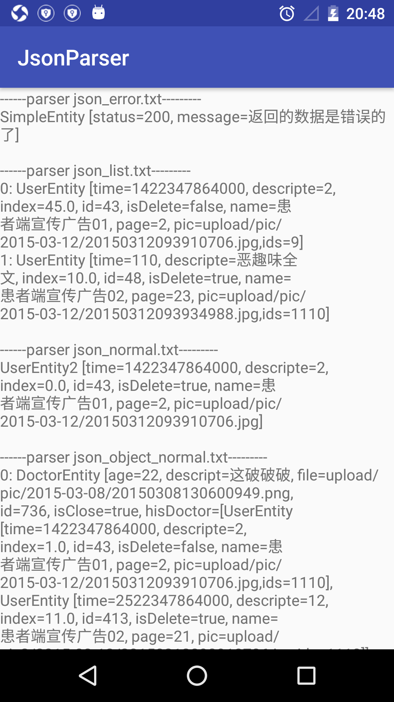

# JsonParser
Json parsing tool can flexibly configure

[![License][licence_svg]][licence_url]
[![Download][bintray_svg]][bintray_url]

# Import
add to build.gradle,${latest.version} is [![Download][bintray_svg]][bintray_url]
```
dependencies {
    compile 'com.blakequ.parser:parser:${latest.version}'
}
```
maven
```
<dependency>
  <groupId>com.blakequ.parser</groupId>
  <artifactId>parser</artifactId>
  <version>${latest.version}</version>
  <type>pom</type>
</dependency>
```


# How to use
you can download example and study how to use

## 1. config json entity

```
Json:json_list.txt
{
    "entities": [
        {
            "createdTime": 1422347864000,
            "descript": "2",
            "index": 45,
            "id": 43,
            "isDeleted": false,
            "name": "患者端宣传广告01",
            "page": "2",
            "ids":9,
            "pic": "upload/pic/2015-03-12/20150312093910706.jpg"
        },
        {
            "descript": "恶趣味全文",
            "index": 10,
            "id": 48,
            "isDeleted": true,
            "name": "患者端宣传广告02",
            "page": "23",
            "pic": "upload/pic/2015-03-12/20150312093934988.jpg"
        }
    ],
    "status": "200"
}

Entity:
@JsonParserClass(parserRoot="entities")
public class UserEntity{
    //need not annotation if name is equal 
	private double index;//json is index, need not JsonParserField
	private int id;
	
	//you can set default value if field is null by invoke defaultValue
	@JsonParserField(defaultValue="1110")
	private Short ids;
	
	//you should set praser name if field is not same with json
	@JsonParserField(praserKey="createdTime", defaultValue="110")
	private long time;
	@JsonParserField(praserKey="descript")
	private String descripte;
	@JsonParserField(praserKey="isDeleted", defaultValue="1")
	private boolean isDelete;
	@JsonParserField(defaultValue="unknow")
	private String name;
	@JsonParserField(defaultValue="0")
	private Long page;
	@JsonParserField(defaultValue="")
	private String pic;
	
	public long getTime() {
		return time;
	}
	public void setTime(long time) {
		this.time = time;
	}
	public String getDescripte() {
		return descripte;
	}
	public void setDescripte(String descripte) {
		this.descripte = descripte;
	}
	public double getIndex() {
		return index;
	}
	public void setIndex(double index) {
		this.index = index;
	}
	public int getId() {
		return id;
	}
	public void setId(int id) {
		this.id = id;
	}
	public boolean isDelete() {
		return isDelete;
	}
	public void setDelete(boolean isDelete) {
		this.isDelete = isDelete;
	}
	public String getName() {
		return name;
	}
	public void setName(String name) {
		this.name = name;
	}
	public Long getPage() {
		return page;
	}
	public void setPage(Long page) {
		this.page = page;
	}
	public String getPic() {
		return pic;
	}
	public void setPic(String pic) {
		this.pic = pic;
	}
	@Override
	public String toString() {
		return "UserEntity [time=" + time + ", descripte=" + descripte
				+ ", index=" + index + ", id=" + id + ", isDelete=" + isDelete
				+ ", name=" + name + ", page=" + page + ", pic=" + pic + ",ids="+ids+"]";
	}

}

```
==notice:if entity field is private, you should provide set and set method==

## 2. get parser result
```
String str2 = ResourceUtils.geFileFromAssets(this, "json_list.txt");
List<UserEntity> user = (List<UserEntity>) JsonParserUtils.initEntityParser(UserEntity.class, str2, true);
```

# screenshot
parser result:
<p></p>

# link
- [BLOG](www.blakequ.com)


[bintray_svg]: https://api.bintray.com/packages/haodynasty/maven/AndroidJsonParser/images/download.svg
[bintray_url]: https://bintray.com/haodynasty/maven/AndroidJsonParser/_latestVersion
[licence_svg]: https://img.shields.io/badge/license-Apache%202-green.svg
[licence_url]: https://www.apache.org/licenses/LICENSE-2.0
